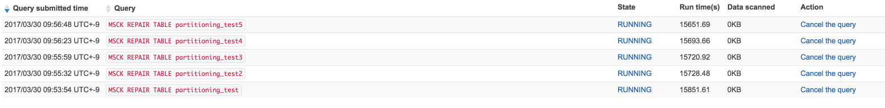

## Create sample partition data

```bash
$ bundle install
$ ./console.rb
irb(main):001:0> data = SamplePartitionData.new('bucket_name')
irb(main):002:0> data.create # create a partition
irb(main):003:0> data.bulk_create(1000) # create 1000 partitions
```

## Result

2017/03/30<br>
Athena: us-west-2<br>
S3 bucket: ap-northeast-1

#### scan 10,000 partitions at once
- 7 minutes 59 seconds
- 265 minutes 17 seconds => cancel
- 263 minutes 41 seconds => cancel
- 263 minutes 16 seconds => cancel
- 262 minutes 53 seconds => cancel
- 262 minutes 57 seconds => cancel
- 75 minutes 9 seconds => cancel

Although the queries had ran over 30 minutes, those didn't killed by Athena.<br>
This behavior confused me, because [the document](http://docs.aws.amazon.com/athena/latest/ug/service-limits.html) said  `Query timeout: 30 minutes`.



#### scan additional 1 partition after 10,000 partitions scaned
- 43 minutes 12 seconds
- 46 minutes 1 seconds

## Query for Athena

```sql
CREATE EXTERNAL TABLE IF NOT EXISTS partitioning_test (
  `first` string,
  `second` string,
  `third` string,
  `fourth` string
) PARTITIONED BY (
  partition_id int
)
ROW FORMAT SERDE 'org.apache.hadoop.hive.serde2.lazy.LazySimpleSerDe'
WITH SERDEPROPERTIES (
  'serialization.format' = ',',
  'field.delim' = ','
) LOCATION 's3://bucket/';
```

```sql
MSCK REPAIR TABLE partitioning_test;
```

## References
- https://www.slideshare.net/tetsutarowatanabe/aws-athena-30tbweb/8


## License

This is available as open source under the terms of the [MIT License](http://opensource.org/licenses/MIT).

Copyright © [pataiji](https://github.com/pataiji) and Speee, Inc.
